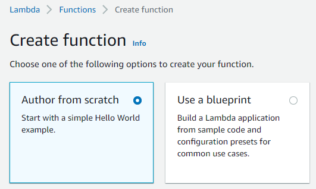

# Alexa Skill Demo

## Creating The Skill Function in AWS Lambda
1. Log in to the AWS Management Console and navigate to AWS Lambda by searching for it in the search bar.\

2. Click **Create function.**\

3. Make sure to confirm that "Author from scratch" option is selected.\

4. Enter a **Function Name** for the function.
5. Select **Java 11 (Correto)** as the **Runtime**
6. Select **x86_64** as the **Architecture**\

7. Click on **Change default execution role** and select **Use an existing role**. In the Existing Role dropdown select **LabRole**\

8. Click **Create function.**

9. Copy the **Function ARN** of your AWS Lambda and save it in a location mentioned during the class period.\

10. Under **Runtime Settings** on the function page click **Edit**\

10. Fill in the Handler information with fully qualified class name of your stream handler class (in our example this value will be `com.amazon.ask.helloworld.HelloWorldStreamHandler`)\

## Clone Repository
11. Open Visual Studio Code click the **Source Control** Button.\

12. Click Clone repository. In the text prompt provide the url: https://github.com/Skylark95/alexa-skill-demo.git\

## Build The Skill Code
13. Open the Visual Studio Code _Command Pallete_ (`Ctrl` + `Shift` + `P`) and select _Tasks: Run Build Task_ to build a jar file for your skill. The jar file will be output to the project directory with the name _alexa-skill-demo.jar_\

## Upload the Jar File to your Function
16. Upload the JAR file produced in the previous step under Function code.\

17. Congratulations! You're done for this session!

## Resources
- https://developer.amazon.com/en-US/docs/alexa/alexa-skills-kit-sdk-for-java/develop-your-first-skill.html